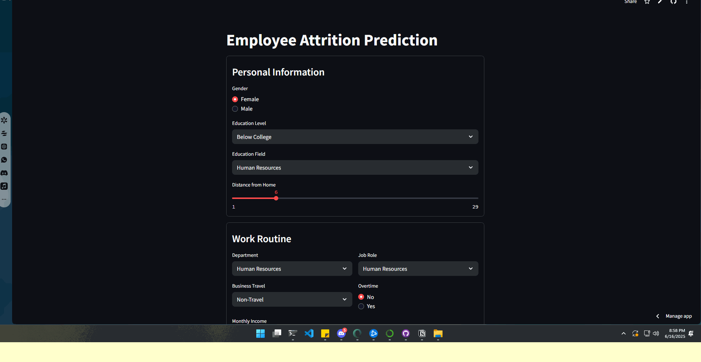

# Employee Attrition Prediction - IBM HR Analytics

This project aims to develop a predictive model capable of estimating the **probability of an employee leaving the company** (*attrition*), based on a dataset simulating a Human Resources scenario. This analysis is valuable for helping companies make more strategic decisions regarding **talent retention** and **workforce management**.

In addition to exploratory data analysis and testing various machine learning algorithms, the final model selected was **Logistic Regression** due to its strong performance and high interpretability for practical business application.

**Access the interactive Streamlit app here:** 
[Steamlit](https://project-ibm-attrition-vinicius-valiati.streamlit.app)

**Read the full article about the dataset and project details here:**  
[Project IBM Attrition Analysis](https://impossible-gondola-c84.notion.site/Project-IBM-attrition-214ffb9f9866807fb05ef42a1ee375a7)



---

## About the Dataset

The dataset used in this project is the **IBM HR Analytics Employee Attrition & Performance**, available on Kaggle.

**Objective**: Predict whether an employee will leave the company (target variable `Attrition`).

📁 [Dataset link on Kaggle](https://www.kaggle.com/datasets/pavansubhasht/ibm-hr-analytics-attrition-dataset/data)

---

## Organization

```
├── .gitignore <- Files and directories to be ignored by Git
├── environment.txt <- The requirements file to reproduce the analysis environment (I use this environment as the default in all my portfolio projects).
├── README.md <- Main README for developers using this project.
|
├── data <- Data files for the project.
|
├── models <- Trained and serialized models, model predictions, or model summaries.
|
├── notebooks <- Jupyter notebooks. Naming convention is a number (for ordering),
| └── src <- Source code for use in this project.
| │
| ├── init.py <- Makes this a Python module
| ├── config.py <- Basic project configurations
| ├── models.py <- Model definitions and configurations
| └── plots.py <- Scripts to create exploratory and result-oriented visualizations
|
├── references <- Data dictionaries, manuals, and other explanatory materials.
|
├── relatorios <- Analyses generated in HTML, PDF, LaTeX, etc.
│ └── images <- Plots and figures generated for reports
```

## Attrition vs. Turnover

Although the terms *attrition* and *turnover* are often used interchangeably, they represent distinct concepts in Human Resources.

### Attrition

- Refers to **voluntary and natural employee departures**, such as retirements or personal resignations.
- Positions are usually **not replaced**.
- Commonly used to describe gradual workforce reduction.
- Useful for long-term strategic planning and analysis.

### Turnover

- Encompasses **all forms of employee separations**, including both voluntary and involuntary (e.g., layoffs).
- Positions are generally **replaced**.
- An important indicator of organizational issues, work climate, or recruitment processes.

### Key Differences

| Aspect                   | Attrition                                   | Turnover                                     |
|--------------------------|---------------------------------------------|----------------------------------------------|
| Nature                   | **Voluntary and natural** departures        | Includes **both voluntary and involuntary**  |
| Replacement of position  | **No replacement**                           | **Positions replaced**                        |
| Strategic implications   | Used for subtle, long-term adjustments      | Requires corrective, short-term actions      |
| Examples                 | Retirement, personal resignation, death     | Layoffs, firings, resignations                |

---

## Modeling

After the exploratory data analysis (EDA) and necessary preprocessing, several classification algorithms were tested. The final model selected was:

### **Logistic Regression (`LogisticRegression`)**

- Provided a good balance between performance and interpretability.
- Facilitates clear communication of results to non-technical stakeholders.
- Helps understand the impact of each feature on employee attrition decisions.

